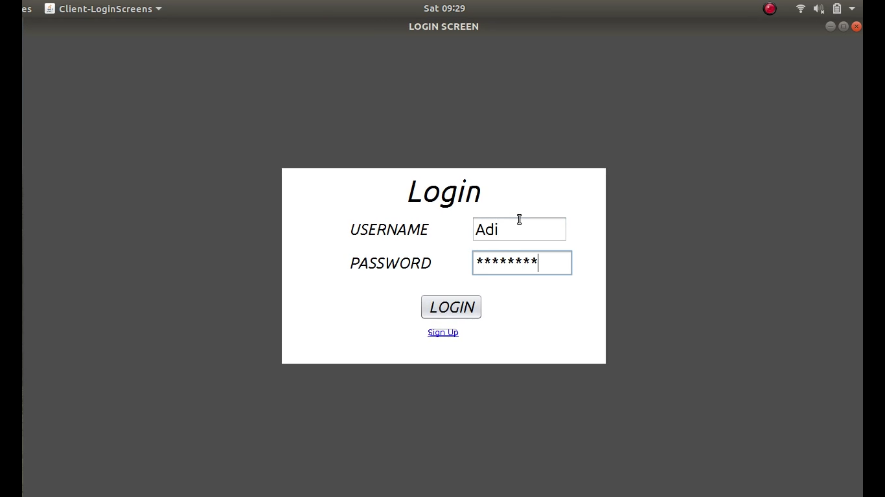
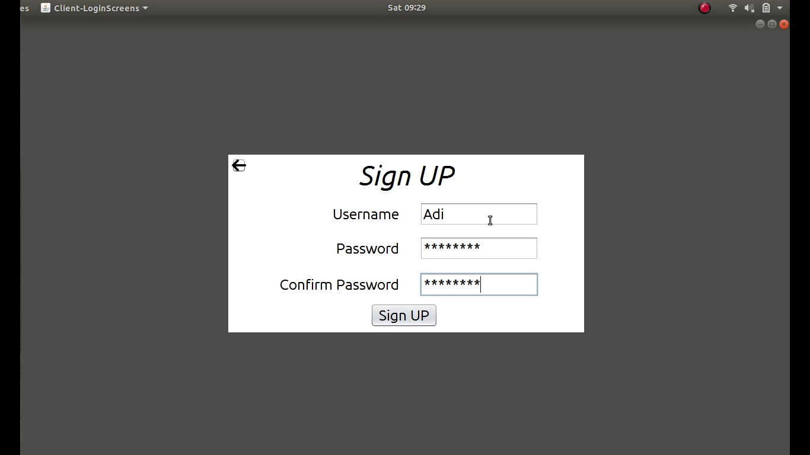
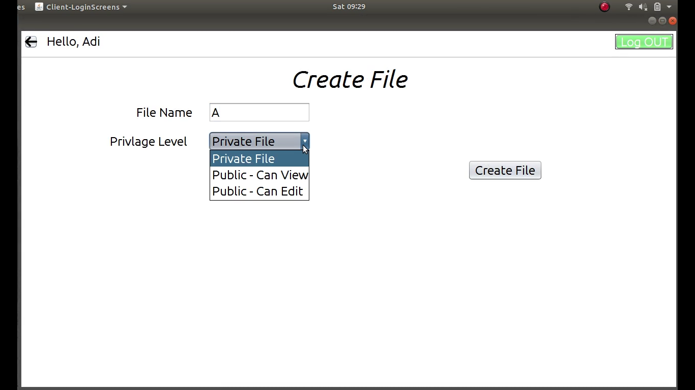
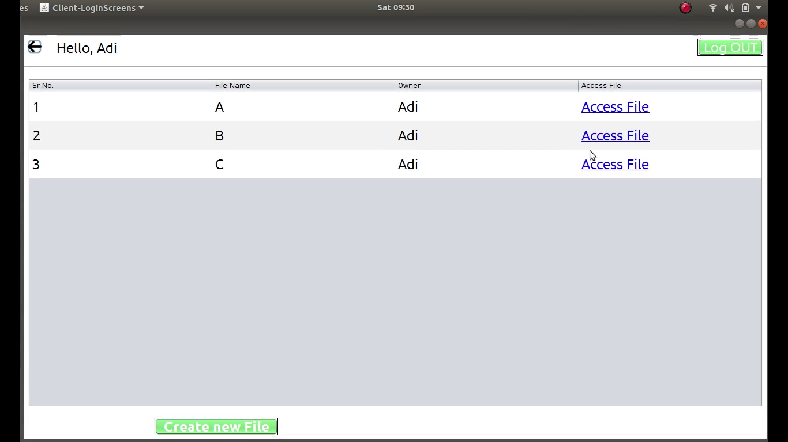
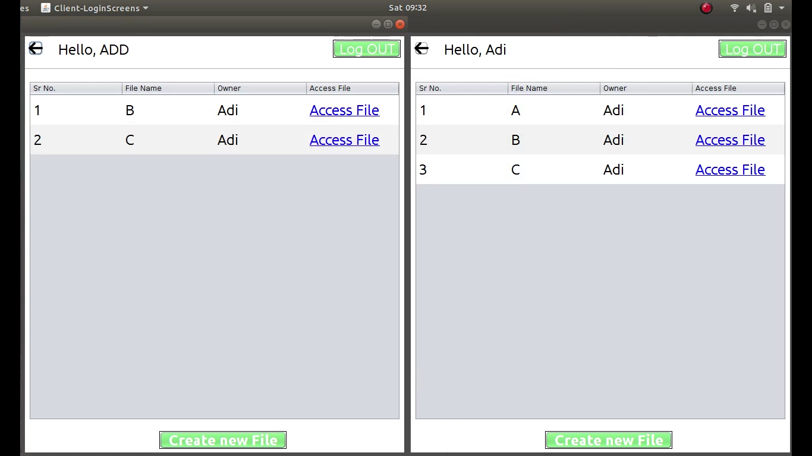
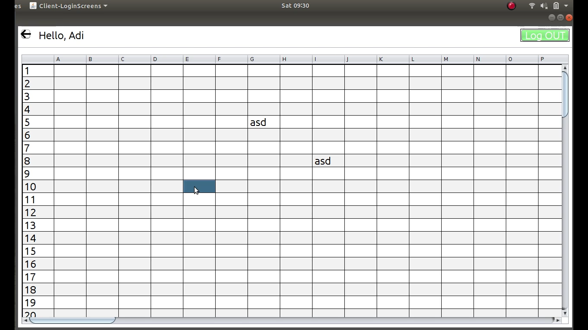
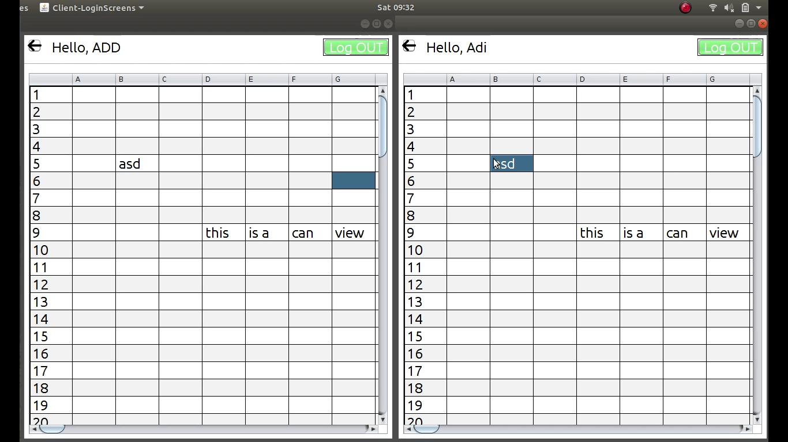

<h1>Distributed SpreadSheet</h1>

&nbsp;&nbsp;&nbsp;&nbsp;&nbsp;&nbsp;&nbsp;&nbsp;This is a Dual Server and Multi Client System that can operate in Distributed Format as It maintains, the properties of a Distributed System ie. Easy Scalability, Failure Handeling, Backup Protocols, etc.

&nbsp;&nbsp;&nbsp;&nbsp;&nbsp;&nbsp;&nbsp;&nbsp;This System is implemented using the JAVA Client-Server methodology. In it We hava connected the Application to a MySQL Server for handaling the Login and SignUp System also the File Access Privilage Level.

<h2>Login & SignUP</h2>

&nbsp;&nbsp;&nbsp;&nbsp;&nbsp;&nbsp;&nbsp;&nbsp;This screen is the Login Screen through Which you can login into the system and access the files created by you or the others according to the Privilage Level.

&nbsp;&nbsp;&nbsp;&nbsp;&nbsp;&nbsp;&nbsp;&nbsp;This screen is the Sign Up Screen through Which new User can Signup into the system and create new Files with Privilage Level.

<h2>Creating a New File</h2>

&nbsp;&nbsp;&nbsp;&nbsp;&nbsp;&nbsp;&nbsp;&nbsp;For creating a new file first the user must Login using his/her Username and Password.

&nbsp;&nbsp;&nbsp;&nbsp;&nbsp;&nbsp;&nbsp;&nbsp;For creating a File as in the above Image the User must give it a name (No need for Extension as by default extension of .csv will be added to the File Name).

<h4>Privilage Level</h4>
<ul>
<li>Private:- Only the Creator of the File can View and Edit the File.</li>
<li>Public & Can View:- Only the Creator of the File can Edit but the Other Members can View the File Contents.</li>
<li>Public & Can Edit:- The Creator of the File and the Other Users all can View and Edit the File.</li>
</ul>

&nbsp;&nbsp;&nbsp;&nbsp;&nbsp;&nbsp;&nbsp;&nbsp;Based of the Privilage Level and the Ownership of the File the List of Files will be accordingly displayed to different Users.

<h2>SpreadSheet</h2>

&nbsp;&nbsp;&nbsp;&nbsp;&nbsp;&nbsp;&nbsp;&nbsp;The SpreadSheet is a 100x100 grid that will be displayed of the Screen, in the backgroung the contents of the cell will be stored in a CSV file.

&nbsp;&nbsp;&nbsp;&nbsp;&nbsp;&nbsp;&nbsp;&nbsp;The Contents of the SpreadSheet is Updated in the Original File in Real Time so any alteration in the file done by one User will be reflected on the Display of all Other Users in Real Time.

